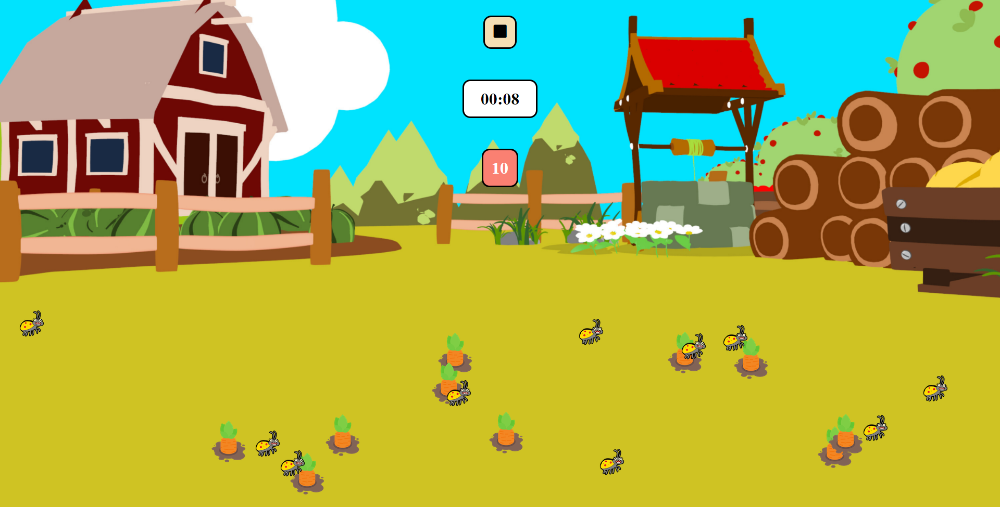

# Harvest Carrots
Simple game using **Vanila Java Script**.

## Launch
___
[github pages](https://hyunchoitan.github.io/carrot-game/)

## Demo Image
___

## Technologies
___
This project is created with 
*  
* 
* 

## Features
___

* Timer will start when a player clicks Play button
* Click carrots to harvest!
* If a player clicks a bug, game will end and show retry banner
* Background music and sound effects are being played during the game

## The Project Status
___

- [x] Mark up HTML
- [x] CSS
- [x] Place Objects randomly on the game field using JS
- [x] Start and Stop Timer using JS
- [x] Create Retry banner using JS
- [x] Handle Clicking the objects on the game field using JS
- [x] Play sound effects
- [x] Create modules and simplify main.js
- [ ] Add some more hover effects to the objects on the field
- [ ] Make next stage when clear one game
- [ ] Make bugs moving
 